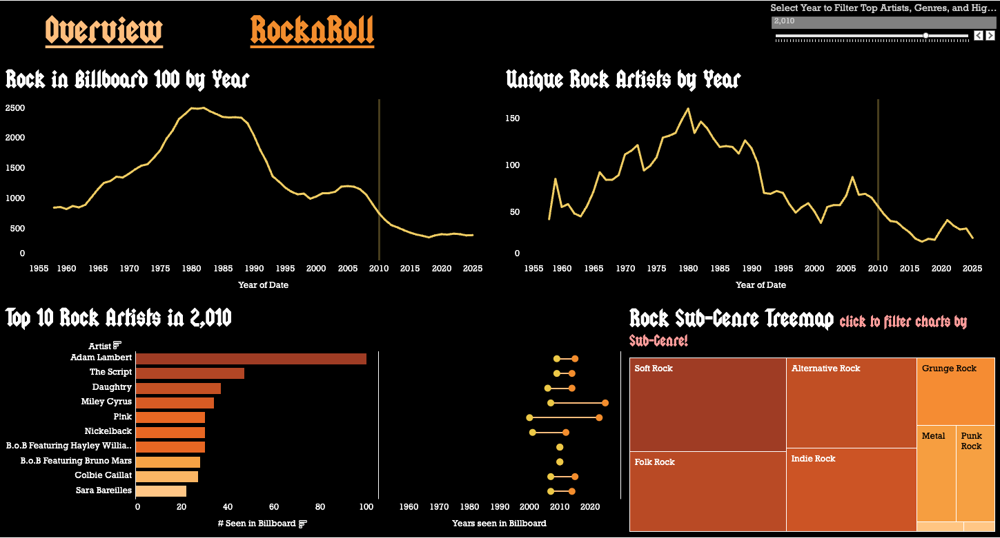

# 🎸 Rock & Roll Through the Decades: A Data & BI Exploration (1958–Present)

## 📌 Project Overview

This project is a **full‑stack analytics + interactive dashboard case study** analyzing the long‑term evolution of **rock music popularity** using over 65 years of Billboard Hot 100 data.

Built as a **BI portfolio project for recruiters and hiring managers**, it demonstrates:

* End‑to‑end data engineering (raw → enriched → BI‑ready)
* SQL + Python analytics workflows
* Static web dashboard design with local precomputed analytics files
* Insight‑driven storytelling for non‑technical stakeholders

The current primary deliverable is an **interactive web dashboard** that allows users to explore how rock music rose, fragmented, and declined relative to other genres—while highlighting key inflection years, artists, and sub‑genres.

---

## 🎯 Audience & Use Case

**Target audience:**

* BI / Analytics hiring managers
* Data analysts & analytics engineers
* Product & strategy teams

**What this project demonstrates:**

* Translating raw cultural data into executive‑level insights
* Designing dashboards that separate **filtering vs highlighting** logic
* Communicating trends, not just charts

---

## 🧱 Project Structure

```text
rock-evolution/
│
├── data/
│   ├── raw/        # Original Billboard Hot 100 dataset (1958 → present)
│   ├── cleaned/    # SQL-cleaned & normalized datasets
│   ├── enriched/   # Artist + genre enrichment (Spotify / MusicBrainz)
│   └── final/      # BI-ready fact tables used in Tableau
│
├── src/            # Python ETL & enrichment scripts
│   ├── fetch_billboard_week.py
│   ├── split_csv.py
│   ├── merge_csv.py
│   ├── enrich_spotify_genres.py
│   ├── enrich_musicbrainz_genres.py
│   ├── classify_genres.py
│   └── clean_artists_by_level.py
│
├── sql/            # SQL transformations & aggregations
│   ├── 01_unique_artists_year.sql
│   └── 02_clean_unique_artists_by_level.sql
│
├── web/            # Static Next.js dashboard and generated JSON data
│   ├── app/
│   ├── scripts/build-dashboard-data.py
│   └── public/data/
│
├── final/          # Final aggregated outputs
│   └── Result_12.csv
│
├── README.md
└── tableau/        # Tableau workbook (local)
```

---

## 🗂️ Data Sources

| Source                | Years         | Purpose                     |
| --------------------- | ------------- | --------------------------- |
| **Billboard Hot 100** | 1958–2025     | Weekly chart rankings       |
| **Spotify Web API**   | 2013–present  | Artist genre metadata       |
| **MusicBrainz API**   | 1950s–present | Historical genre validation |

Primary raw file:

* `billboard_hot-100_1958-08-09_to_latest.csv`

---

## 🧮 Technical Stack

### Data Engineering & Analytics

* **Python 3** (`pandas`, `requests`, `dotenv`)
* **SQL** (aggregation, deduplication, normalization)
* Modular ETL pipeline with reproducible steps

### Dashboard

* **Next.js / React / TypeScript**
* **Recharts**
* Static JSON data generated from the local Billboard master file
* No live API keys required for the dashboard

---

## 🌐 Web Dashboard (Primary Deliverable)

The web dashboard is the new portfolio version of the project. It keeps the music-magazine energy of the Tableau version, but adds a stronger analytics layer and a cleaner interaction model.

### Run Locally

```bash
cd web
npm install
npm run data
npm run dev
```

Then open:

```text
http://localhost:3000
```

### Build

```bash
cd web
npm run lint
npm run build
```

### Added Analytics

* **Chart-point share:** rank-weighted genre share using `101 - rank`, so #1 hits matter more than #100 entries.
* **Rock dominance index:** annual rock chart-point share against all known-genre chart points.
* **Genre concentration / fragmentation:** HHI and entropy by year.
* **Artist churn:** new vs retained artists by year.
* **Artist longevity:** first year, last year, active years, entries, chart points, and peak rank.
* **Rock subgenre mix:** rock-tag family breakdown from raw genre tags.
* **Data quality visibility:** missing genre counts and missing genre rate.

---

## 📊 Tableau Dashboard (Earlier Version)

### 📊 Interactive Dashboard

🔗 **View the full interactive Tableau dashboard:**  
👉 [https://public.tableau.com/views/YourDashboardLink](https://public.tableau.com/app/profile/jinwoo.roh/viz/Evolution_of_Music_Genre/Overview)

#### Rock Evolution Dashboard
[](https://public.tableau.com/app/profile/jinwoo.roh/viz/Evolution_of_Music_Genre/Overview)

The Tableau dashboard is the earlier BI version of this project. It remains useful as a design and workflow reference, but the web dashboard is now the primary portfolio artifact.

### Key Design Goals

* One **global year slider**
* Filters Top‑10 artists **only**
* Highlights trends across all other charts
* Clear separation between:

  * *Filtering* (who appears)
  * *Highlighting* (where that year sits in history)

### Dashboard Sections

**1. Rock vs Non‑Rock by Year**

* Shows rock’s long‑term decline relative to other genres
* Year selector highlights historical context without reshaping the line

**2. Genre Composition of Billboard 100**

* Multi‑line chart showing genre dominance shifts
* Reveals the rise of hip‑hop and pop fragmentation

**3. Unique Artists per Year**

* Measures market saturation and artist churn
* Highlights increasing artist turnover post‑2000

**4. Genre Longevity & Recency Distribution**

* Boxplots showing when genres peaked and faded
* Rock shows earlier median years vs newer genres

**5. Top 10 Artists (Selected Year / All Time)**

* Parameter‑driven logic:

  * Specific year → top artists in that year
  * “ALL” → most frequent artists historically

**6. Rock Sub‑Genre Treemap**

* Clickable interaction to filter all views
* Shows fragmentation of rock into sub‑genres

---

## 🔍 Insight Preview (Key Findings)

### 📉 Structural Decline of Rock

* Rock peaked between **1975–1990**, dominating Billboard entries
* After 2000, rock steadily declined as hip‑hop and pop diversified

### 🔄 Artist Turnover Increased

* Unique artists per year increased significantly after the 1990s
* Indicates shorter chart lifespans and faster trend cycles

### 🎸 Fragmentation Over Extinction

* Rock did not disappear—it **fragmented**
* Growth observed in:

  * Alternative Rock
  * Indie Rock
  * Folk‑Rock hybrids

### 🏆 Artist Longevity

* Legacy artists dominate “ALL‑time” rankings
* Modern charts show faster churn, fewer repeat appearances

---

## 💡 Why This Project Matters

This project mirrors **real BI work**:

* Messy data
* Ambiguous definitions (genre classification)
* Trade‑offs between interactivity and interpretability

It demonstrates not just technical skill—but **analytical judgment and storytelling**.

---

## 🚀 Future Extensions

* Time‑series forecasting (Prophet / ARIMA)
* Streaming vs chart correlation analysis
* Regional genre dominance analysis
* Public deployment with Tableau Public embed

---

## 👤 Author

**Jinwoo Roh**
Marketing & Data Analytics Professional
BI / Analytics Portfolio Project

